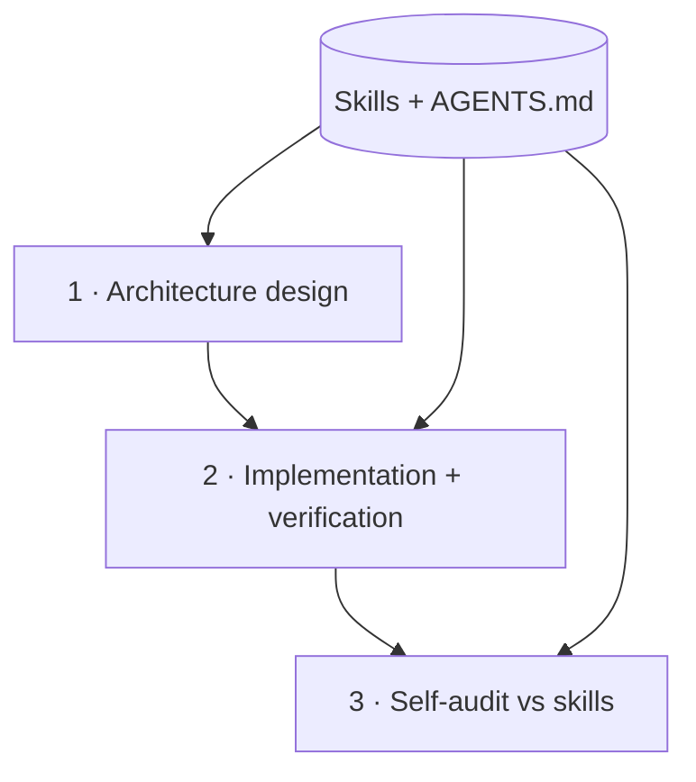

# Chapter 5: Key #3 — Engineering Discipline as Code

> **Thesis**: Skills are not a one-time install. They are the living residue of your break-in process, encoding *this* project's specific bad habits. The generic engineering principles are the starting line, not the finish.

---

## Why correctness isn't enough

Chapter 4 made correctness a mechanism. A piece of code can be correct and still be catastrophic for the codebase — badly structured, overcoupled, using three different naming conventions, inventing utilities that already exist two directories over. Correctness gets you past today; **maintainability** decides whether next week's agent can work in the code you shipped this week.

In a one-agent, human-reviewed workflow, maintainability was enforced by you in review. You'd say "don't use inheritance here, use a strategy object" and the agent would adjust. That path doesn't scale to three agents producing three PRs in the same hour. Either you enforce it by mechanism, or it stops getting enforced.

The mechanism is **skills**. Skills are structured documents, loaded at agent startup, that shape how the agent approaches design and self-reviews its output. They turn "things you'd say in review" into "things the agent checks before it ships."

## Generic principles — the starting line

The first half of what belongs in a project's skill set is the generic software-design discipline you'd expect in any review. Most of it comes from Ousterhout's *A Philosophy of Software Design* and can be encoded cleanly into a short skill that raises an agent's first-draft architecture from *default* to *usably-competent*:

- **Deep modules.** Simple interfaces, significant functionality behind them. Agents default to breaking things into too-small pieces; the skill should push back explicitly.
- **Information hiding.** Modules shouldn't leak internals. The agent's common failure mode here is splitting by execution order ("step A module, step B module") instead of by knowledge ownership — which almost guarantees leakage.
- **Layered abstraction.** Each layer provides a distinct mental model. A layer that only forwards calls to the next layer isn't earning its keep.
- **Cohesion and separation.** Code that must be understood together stays together; generic and special-case logic that confuses each other gets split.
- **Error handling through definition.** Prefer designs that *define errors away* (default behavior, simplified semantics) over designs that spray `try/catch` everywhere.
- **Naming and obviousness.** Readers shouldn't be surprised. Names should be specific, consistent across the codebase, and free of invented abbreviations.
- **Documentation that adds information.** Comments should describe what the code cannot — intent, trade-offs, invariants. Not what it literally does.
- **Strategic over tactical design.** Every change is an investment in the structure. Quick fixes compound into tech debt with interest.

These are good defaults. Encoded as a skill, they put the agent's first-draft architecture substantially above its untrained baseline.

But generic principles have a ceiling. An agent that "knows" them can still miss that your codebase already has the utility it's about to reinvent, use a naming style that matches one file from two years ago but not the rest, or pick a pattern that's right in the abstract and wrong for the framework you're on. The generic skill can't catch these because they are **specific to your project**. Past the generic line, skills have to be yours.

> If you want the craft of writing a single skill document well — structure, description wording, triggers, failure modes — that's the subject of *[The Skill Design Book](https://github.com/A7um/SkillDesignBook)*. This chapter is about how skills function as **the maintainability mechanism in a parallel workflow**, not how to author one.

## How pioneers actually accumulate their skills (and what 2026 research says)

The industry has standardized, in the six months before this writing, on `AGENTS.md` as the cross-tool context file. It is adopted by Claude Code (via `CLAUDE.md` symlink), Cursor, Codex, Gemini's antigravity, and most other major agents. The most useful current reference is [*How to Build Your AGENTS.md (2026)*](https://www.augmentcode.com/guides/how-to-build-agents-md) from the Augment team (March 2026).

Several findings from the last six months are worth internalizing before you write yours:

- **Keep it under about 150 lines.** ETH Zurich's Feb 2026 research (summarized in Paul Withers' *[Is AGENTS.md Engineering the next optimisation approach?](https://paulswithers.github.io/blog/2026/02/23/agentsmd-engineering/)*) found that verbose or LLM-generated `AGENTS.md` files actually *reduce* task success rates and inflate cost, because of "lost in the middle" degradation on long context. Human-curated, concise files perform measurably better.
- **Nest for modularity.** Agents prioritize the `AGENTS.md` closest to the current working directory. Use a short root file for repo-wide rules, and drop focused `AGENTS.md` files into subdirectories that need different rules.
- **Symlink for cross-tool compatibility.** The conventional 2026 move is `ln -s AGENTS.md CLAUDE.md` so every agent you use reads the same file regardless of its preferred name. This is now standard.
- **Treat it like code.** Check it in, version-control it, review it in PRs. Mitchell Hashimoto's [*My AI Adoption Journey* (Feb 2026)](https://mitchellh.com/writing/my-ai-adoption-journey) treats `AGENTS.md` as a living contract updated every time a failure class is observed — not a one-time write.
- **Skills are a separate channel.** Anthropic's [Agent Skills](https://platform.claude.com/docs/en/agents-and-tools/agent-skills/overview) and Addy Osmani's [2026 writeup of the same pattern](https://beyond.addy.ie/2026-trends/) distinguish *always-loaded* context (`AGENTS.md`) from *loaded-on-demand* skills (`SKILL.md` in its own directory, triggered by task relevance). The split is significant because it lets you have fifty specialized skills without bloating every session.

The 2026 consensus, compressed: **one lean `AGENTS.md` for durable repo-wide rules, a library of focused `SKILL.md` packages for task-specific workflows, both checked in, both versioned, both reviewed in PR.** A mature project ends up with one root `AGENTS.md` of roughly 60–120 lines and ten to forty focused skill documents, each tied to a specific class of mistake the agent made once and should never make again. The shape of an individual skill — description, triggers, body, checklist — is covered in [*The Skill Design Book*](https://github.com/A7um/SkillDesignBook); what matters here is that **every rule in the file comes from a specific failure, carries its reason, and would not be there if you hadn't watched the agent get it wrong**.

The skills that actually move the quality needle are the ones that encode the mistakes *your* agent made *in your codebase*. "Follow good naming conventions" is useless — the agent already tries to. "In this codebase the convention for handler names is `handle<EntityName><Action>`; the agent tends to write `<entityName>Handler` and gets it wrong" is gold. That specificity is the whole point.

> **The generic skills are the default setup. The specific skills are where the break-in residue lives.** The former you write once; the latter you accumulate one failure at a time.

## The three-stage execution flow

With skills in place, the work an agent does on a feature looks like this:

1. **Architecture design.** Given requirement spec (Ch 3) and test plan (Ch 4), the agent proposes module boundaries, interfaces, file organization, and abstractions. It does this with skills loaded — so the design already reflects the deep-modules, information-hiding, naming-consistency rules. The human reviews this design at complexity-triaged depth. Getting this step right is what makes Chapter 7's mode 4 (agent-internal parallelism) possible at all, because the interface contracts defined here are what let sub-agents work in parallel without colliding.
2. **Implementation and verification.** The agent writes code and tests, runs the suite, debugs failures, iterates to green (Chapter 4).
3. **Self-audit.** Before declaring done, the agent re-reads its own diff with the skill set loaded and checks for violations: shallow modules, redundant layers, inconsistent naming, utilities that duplicate existing ones. It fixes what it finds.

Steps 1 and 3 are new. They replace the architectural judgment and final polish that you'd otherwise apply in review. You're still involved — you approve the architecture, you spot-check the self-audit on high-complexity work — but you are no longer the *only* line of defense.

## Where skill injection still isn't enough

Being honest about the limits:

- **Conflicts between principles.** Deep modules vs small composable pieces; strategic design vs YAGNI. These genuinely conflict, and skills can't arbitrate — judgment does. For contested cases the agent needs explicit guidance in the skill: "in *this* codebase, prefer deep modules even if it means the module is harder to unit-test in isolation; we value the interface simplicity more."
- **Cross-cutting concerns.** Security, observability, performance — they don't live in one module, and a skill that says "think about security" is too vague to act on. These usually need either (a) dedicated tooling (linters, scanners) or (b) very specific skills ("on any endpoint that writes to the database, require that the caller's permission was checked in the handler before the DB call").
- **Taste drift between agents.** Different agents trained on different data have different biases. A skill set tuned to Claude may read differently to a Codex model. This is a real limit of the portability story; budget time for re-tuning when you switch primary agents.
- **Novel subsystems.** The first time you touch a new framework, a new language, or a new service, you don't yet know the failure modes. There are no skills to write yet. You pay tuition (Chapter 2) on that subsystem specifically, then write skills from what you learned.

None of these is fatal. All of them mean "skills get you a long way, not all the way."

## The link to parallel scheduling

This chapter lives in Part III of the book, about unlocking parallel work. The connection to Chapter 7 (scheduling patterns) is direct:

- Modes 1–3 work better when agents load a shared skill set. Without it, three agents produce three styles of code and merges become a mess.
- **Mode 4 — agent-internal parallelism — is essentially impossible without interface contracts defined in the architecture step.** Sub-agents working in parallel on different modules can only merge cleanly if the interfaces between them were pinned down up-front. This is the direct dividend of Key #3: the architectural discipline you enforce is what makes parallel decomposition feasible.

Skipping architecture and letting the agent "just code" is the single fastest way to lose the parallel benefit. It works for one agent on a small feature. It catastrophically fails with three agents on a medium one.

## The zero-review reference

The `zero-review/auto-dev` skill encodes this three-stage loop — architecture design, implementation-and-verification, self-audit — as a runnable skill, including Ousterhout-derived design principles and a concrete self-audit checklist. It's worth reading as the canonical example of "engineering discipline encoded as a skill."

*Reference*: [`zero-review/auto-dev`](https://github.com/A7um/zero-review/tree/main/skills/auto-dev)

---

## External voices

- **Supporting**: *A Philosophy of Software Design* (Ousterhout) remains the best single source on the underlying principles. Anthropic's [Agent Skills documentation](https://platform.claude.com/docs/en/agents-and-tools/agent-skills/overview) formalizes the injection mechanism. For the craft of authoring a single skill document, defer to [*The Skill Design Book*](https://github.com/A7um/SkillDesignBook).
- **Challenging**: critics of "rules-based design" argue that encoded principles ossify into cargo-cult checklists that miss the point. This is a real risk, especially for generic skills. The counter is that project-specific skills don't generalize and therefore don't ossify — they stay tied to the scar they came from.

## What's next

Part III is complete. Chapter 6 opens Part IV with the economic phase-change that unlocks parallel *execution*: when attempts cost minutes instead of hours, exploration gets cheap, and best-of-N stops being a luxury.
