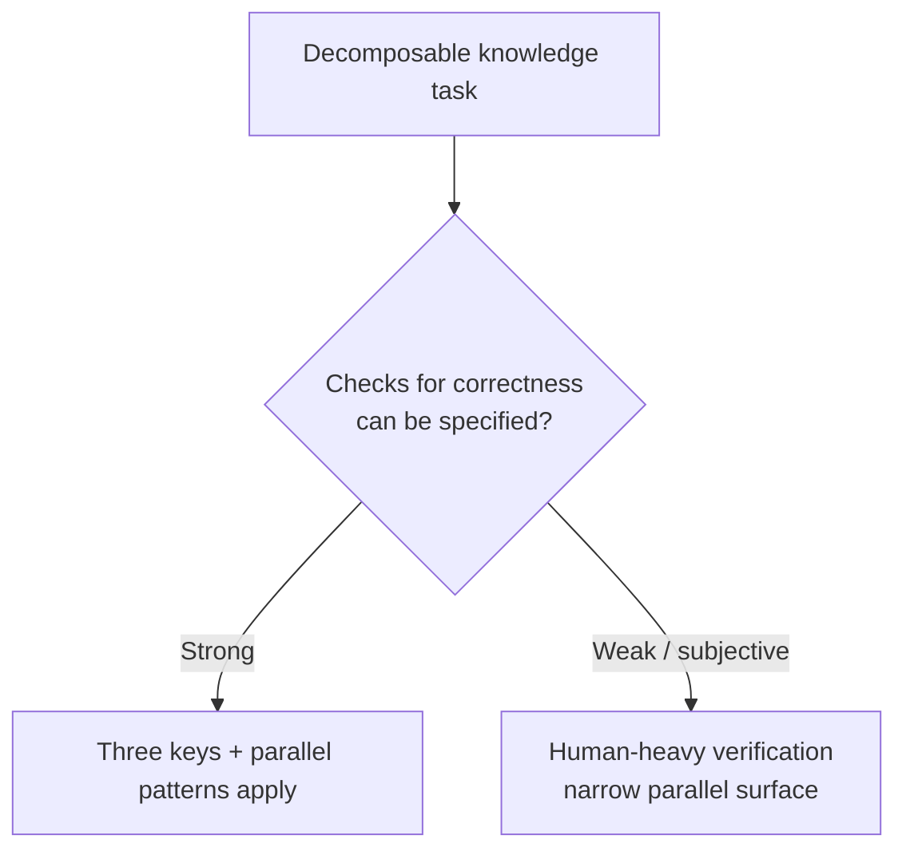

# Chapter 10: Beyond Code

> **Thesis**: Every decomposable knowledge task obeys the same rules. Coding is just the first domain where the loop closes end-to-end — and understanding that tells you which other domains are coming next.

---

## Why code was first

If the framework in this book (three chokepoints, three keys, four scheduling modes, break-in period) is really about *knowledge work*, why did coding reach this point first?

Three structural reasons, and they're worth naming because they predict where this spreads next:

1. **Code has formal verification.** Tests give you an automatic answer to "is this right?" You can run them, get a green or red, and the agent can close its own loop. Almost no other knowledge work has this property natively.
2. **Code has cheap failure.** A wrong implementation is caught by a test in seconds. A wrong diagnosis, a wrong strategy memo, or a wrong design is caught by a human much later, at much higher cost.
3. **Code has a mature engineering culture.** Software engineering has already argued for decades about modularity, testing, and interface design. When agents arrived, there was a vocabulary (Ousterhout, Martin, Beck) ready to be encoded into skills. Most other fields lack this.

Take these three away and you get the opposite: a domain where agents can't self-verify, failure is expensive, and there's no inherited discipline to encode. That domain cannot currently run the three-keys playbook. The domains that *can* run it are the ones with the strongest analogs to all three.

## The same framework, re-applied

Consider data analysis. Replace "code" with "analysis":

- **Chokepoint 1** (requirement alignment): what are we actually trying to decide with this data? Which stakeholder will act on the answer?
- **Chokepoint 2** (correctness): is the analysis methodologically sound? Are the assumptions valid? This is the hard one — there's no `npm test` equivalent. But there *is* a "test plan for the analysis": a checklist of assumptions, sensitivity checks, alternative slicings. An agent can run them.
- **Chokepoint 3** (maintainability): will the next person to touch this dataset understand what was done? Are the derivations reproducible? Is the pipeline documented?

The three keys translate directly:
- **Requirement alignment** → define the decision the analysis will drive. Use Chapter 3's two techniques unchanged.
- **Correctness as contract** → build the methodological checklist *before* the analysis. Let the agent run it and report failures.
- **Discipline as code** → encode data-team conventions (how notebooks are structured, where intermediate outputs live, how units and provenance are documented) as skills.

This isn't speculative. Teams are doing it. The break-in period looks familiar: Phase 1 chaos, Phase 2 awareness, Phase 3 templates, Phase 4 leverage. Same curve.

## Other domains where the loop is closing

A partial and opinionated list, in rough order of how close each is:

- **Data analysis.** Already well along. Analysis notebooks with agent-written methodology, running against methodology checklists, with style skills encoding team conventions. Ships today for some teams.
- **Research / literature review.** The test-plan analog is "criteria for what counts as a relevant source" and "claims the review must address." Multiple agents can review in parallel on different sub-questions. Merge is the summary.
- **Design / UX exploration.** Best-of-N is the natural move: multiple design attempts against a shared spec, human picks. Skills encode the design system. Agents can critique each other's work against accessibility and consistency checklists.
- **Writing (long-form, technical).** This book is being drafted this way. Chapter outlines are the requirement. A consistent voice is the test plan (with agent-as-reader checking for voice breaks). Skills encode the style guide. Multiple chapters draft in parallel.
- **Legal / compliance review.** The contract is clear ("these clauses must/must not appear"). Mature; the bottleneck is professional liability, not technical.
- **Strategy / decision memos.** Harder, because there's no automatic "right answer" test. But the alignment-first + multiple-attempts-filtered pattern still helps dramatically for framing.
- **Operations / incident response.** The triage layer in Chapter 8 is already a version of this. Agent-driven runbook execution, with triage routing to humans only on novel failures, is moving fast.

Notice the pattern: **the domains furthest along are the ones where "what counts as correct" can be specified, even if it can't be fully automated.** The domains lagging are the ones where correctness is genuinely subjective and resists encoding.

## What doesn't translate (yet)

Being honest about limits:

- **Hardware-bounded work.** An agent can plan and document a physical experiment; it cannot run the lab. Until robotics catches up, physical iteration loops stay human.
- **Work requiring a body of tacit judgment.** Clinical medicine, senior negotiation, courtroom advocacy. The agent can prepare and assist; it cannot currently replace the tacit competence of a practitioner who has seen ten thousand cases.
- **Anything where the cost of one wrong output is catastrophic and not recoverable.** Launch-vehicle code. Surgery. Monetary policy. The cheap-failure assumption (Chapter 6) breaks, and the whole parallel playbook tightens sharply. You can still use it, but you have to re-price the "cheap" in cheap failure.

The boundaries will move. Robotics will close the hardware gap. Better calibration on agent uncertainty will extend the safe range for high-stakes work. The current list of "doesn't translate" is a snapshot, not a verdict.

## What this means for readers

If you're a working engineer using this book for coding, the last chapter is still actionable: **the skills you've built through the break-in period generalize**. Not the specific code skills — those stay tied to your codebase — but the *meta-skills*:

- How to structure requirement alignment.
- How to write a test plan that is actually an acceptance contract.
- How to encode discipline as a loadable document.
- How to schedule parallel work without drowning in output.
- How to defend your slack against the leverage.

These meta-skills are worth more than any specific codebase skill, because they transfer. Every new domain you enter after coding will have its own version of the three chokepoints, the three keys, the four modes. You'll recognize them faster because you've seen them in code first.

## The meta-frame, one more time

Strip the whole book down to one sentence:

> **Parallel AI productivity is not an agent capability. It is a workflow you and your agents co-adapt into, by mechanizing the three places where your attention used to be forced serial. The domains where you can mechanize those three places are the domains where this works.**

That sentence is short enough to remember. It's also nearly complete — the break-in period, the scheduling modes, the cheap-failure phase change, and the honest cost in Chapter 9 are all implied consequences of it.

## A closing note

The framework in this book is opinionated. It is also not finished. The triage layer (Chapter 8) is actively under development. Mode 4 (Chapter 7) is genuinely frontier. The translation to domains beyond code, discussed here, is earliest-days. If you read this book in a year and some specifics look dated, the *shape* of the argument — bottleneck moves, keys unlock it, break-in is real, honest cost — should still hold.

If the shape doesn't hold, someone will have found a deeper frame. That would be a good outcome too.

---

## External voices

- **Supporting**: writings on AI-augmented workflows in research (various "AI-assisted literature review" posts), writing (Ethan Mollick's *Co-Intelligence*), strategy (the emerging genre of "AI-assisted memo" posts in ops/strategy circles). Each is an independent rediscovery of the three-chokepoints / three-keys structure in a different domain.
- **Challenging**: domain experts in each of the non-code fields above have real, often correct, reasons to doubt that "their domain" is next. Listen to the reasons. Most of them are variants of "we don't have a test-plan analog" — which is true now and may change.

> TODO (author's note): drop in pioneer posts from data, research, writing, design — anywhere the three-keys pattern shows up under different vocabulary.

## The end

Thank you for reading. The rest is yours — your break-in, your skills, your projects, your parallel agents. This book cannot do the work for you. It can only tell you that the road has a shape, and what the shape is.

Good luck. Ship well. Stay rested.

---

*By [Atum](https://atum.li) — Source: [github.com/A7um/ParallelDevelopmentBook](https://github.com/A7um/ParallelDevelopmentBook)*
