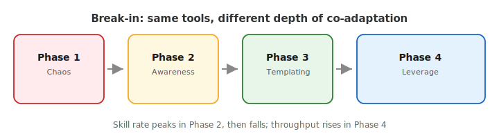

# 第 2 章：磨合——AI 协作的隐形学费

> **论点**：本书的一切只在你和你的工作流相互适应**之后**才成立。多数得出"并行 AI 是炒作"的人，其实是卡在了一条四阶段曲线的第一阶段，不知道后面还有三个阶段。

---

## 什么叫"磨合"

把一双新皮靴穿上，第一周是磨脚的。一台新发动机要先低速跑一千英里才敢把转速拉到红区。招一个资深工程师进来，一般要三个月才能看出他真实水平。这三件事里，工具和环境都在**相互适应**——工具在适应任务，环境在摸清工具真正的边界。

AI Agent 工作流就是同一回事。你不是"安装"并行开发，你是**磨合**进它。磨合期留下来的结晶——你写的 skill、你打磨过的 prompt 模板、你练出的任务拆分习惯、你学到的回避套路——就是后面第 3、4、5 章那三把钥匙真正兑现回报的前提。没有这些结晶，那几章的机制就只是纸面上的字。

这也是多数 AI 开发书跳过的一章，因为它不好卖。大家都在写目的地，几乎没人写路。

## 四个阶段

磨合不是"平滑地变好"那种意义上的渐进。它有形状。四个阶段，每个阶段都有自己独有的体验，也都有表明你走出了这个阶段的信号。

### 第一阶段：混沌

**感觉上**：你读了这本书或类似的东西，你一次性开了三个 Agent。一小时内，其中两个改动了重叠的文件，一个对需求的解读和你想的不一样，你手上有三个都需要大量返工的 PR。到了下班，你比自己写代码还累，产出还更差。

**这时大多数人会下的结论**：并行 AI 就是炒作，跑不通的。

**为什么他们错了**：这场灾难的每一步都可以预见。你没有搭好那个能让三个 Agent 保持一致的共享上下文底座（skill、`AGENTS.md`、架构约定）。你没有写能在早期抓住解读漂移的测试计划。你没有挑那种本来就不会撞车的正交任务。这不是工作流的错——是你在用第四阶段的工作流做第一阶段的事。

**离开第一阶段的信号**：你开始识别失败的**类别**，而不是一个一个 bug。"哦——又来了，Agent 又在明明已有工具函数的情况下自己发明一个。"一旦你能给一种失败模式命名，你就能为它写一条 skill。

### 第二阶段：觉察

**感觉上**：你大部分时间还在一次一个 Agent。但你不再对每个错误单点应对了。你开始注意到 Agent 总是在某一类地方犯同样的错，或者在某种架构选择上总是猜同一个方向，或者总是漏掉某一类边界情况。你的 `AGENTS.md` 开始长出来。你写了第一条真正的 skill——大概率是覆盖某一类在第一阶段坑过你的错误。

Mitchell Hashimoto 的 [*My AI Adoption Journey*](https://mitchellh.com/writing/my-ai-adoption-journey) 是这段转变最清楚的公开记录。他描述前一段时期是"痛苦难熬的"和"一段效率低下的时期"——把转机归因于*打磨自己的 harness*：写 `AGENTS.md` 编码约束、用确定性的钩子阻止重复发生的错误，甚至*刻意先手动做一遍再让 Agent 做*，以此建立授权所需要的专业判断力。他对过渡的描述（"Agent 在架构任务、高性能数据结构、语言特异性很强的逻辑上失败，逼我手动重写或者跟它搏斗"）是教科书式的第一阶段报告。他的解法是教科书式的第二阶段动作。

**这时工作的形态是**：敲代码的时间在减少，写规则的时间在增加。你感觉自己"工程做得少了"，这种感觉让你别扭，但代码质量开始往上爬。

**离开第二阶段的信号**：你开始把同一条 skill **不做改动地**复用到新任务上。某一天你在一个新功能里调用两周前写的那条 skill，它一次就跑通——你就已经迈出了第二阶段。

### 第三阶段：模板化

**感觉上**：你有了一份管用的 playbook。需求对齐有了你熟悉的形状。测试计划的结构大体相似。真的要审代码时，你检查的是那几件 skill 应该已经覆盖到的事。你现在经常同时跑两个 Agent——任务是你刻意挑的，因为它们不会撞车。

**这时工作的形态是**：新 skill 还在写，但速率在下降。你不是在发现新的错误类别了，而是在打磨已有的 skill。

Harper Reed 的 [*My LLM codegen workflow atm*](https://harper.blog/2025/02/16/my-llm-codegen-workflow-atm/)（2025 年 2 月，是今天 2026 年 Plan Mode / SDD 共识的祖先）是一份公开的第三阶段作品。他发出来的不是什么小聪明——是一个在足够多项目中反复使用后已经能描述其形状的**模板**。idea-honing 的 prompt、blueprint 的 prompt、`todo.md` 的检查表——每一条都是他之前临场做过好几遍后才结晶下来的。这就是第三阶段从外面看的样子——你开始能把自己的工作流写下来，因为它已经稳定到可描述。（当前 2026 年的接替方案——第 3 章里 Plan Mode + SDD 的形状——是同一模式但多了验收契约；Reed 写帖子时它还不存在。）

**离开第三阶段的信号**：你开始能**同时跑超过三个 Agent**做重要工作，还不会一整天都在切上下文。第 7 章里的调度模式从"吃力"变成"自然"。

### 第四阶段：杠杆

**感觉上**：三把钥匙在大部分工作上自动运转。多个并行 Agent 产出的代码风格一致。你的时间大部分在需求对齐和高层判断，不在执行。你在科技 Twitter 上看到"AI 搞不了真开发"的时候，你知道他们没说谎——他们只是在描述第一阶段。

Cherny 公开的[月度数字](https://www.reddit.com/r/ClaudeAI/comments/1px44q0/claude_code_creator_boris_cherny_reports_a_full/)里，30 天 259 个 PR、497 次提交、加 40k 行、删 38k 行，代码全部出自 Claude Code，约 1.6k 个 session、累计约 3.25 亿 token（325 million）——这就是第四阶段从外面能看到的吞吐。数字里最有意思的往往不是「加了多少」，而是「**删了多少**」。38k 行不会是手滑删掉的；到了第四阶段，你终于有余力还债，把新功能之外的历史包袱也一并清掉。

**这里能做到而之前做不到的事**：best-of-N 作为默认动作（第 6 章）、Agent 内部的并行（第 7 章模式四），以及——说白了——接下那些一个人干太激进的活。这才是这本书真正在卖的杠杆。

**第四阶段的陷阱**：你忘了磨合过。你向朋友推荐这套工作流，他一夜之间进了第一阶段，然后得出结论说你在忽悠他。

## 每个阶段要多久

这个问题没有诚实的通用答案。影响最大的变量：

- **代码库的成熟度。** 有强约定、好测试、清晰模块结构的代码库会缩短每一个阶段。
- **你写东西下来的程度。** 第二阶段本质就是"把东西写下来"。习惯靠口传传授的工程师走得慢。
- **工具切换。** 每次你换主力 Agent（Cursor → Claude Code → Codex），你会倒退半个到一整个阶段。
- **团队规模。** 独立开发者前期快一些，团队要等到共享 skill 被写下来之前都卡住。

我自己的粗略估算——我想说清楚这是估算不是测量：大多数独立工程师，在一个他认真维护的代码库上会到第三阶段。能到第四阶段的是少数。团队能到第四阶段的条件是，有人专门把 skill 当作共享资产来投入。

## 该测什么

没测的东西没法管。我所知最便宜的磨合阶段指标是你在一个认真维护的代码库上的**每周新 skill 数**：

- 第一阶段：零（你还不知道要写什么）
- 第二阶段：每周 2–5 条（闸门打开）
- 第三阶段：下降中，从每周 2 条往每周不到 1 条走
- 第四阶段：稳态接近零；碰到新子系统时会短暂飙高

当速率接近零**并且**你交付干净时，你就在第四阶段。当速率接近零**但**你交付得糟糕时，那是你停止注意了。

第二个信号：**你在需求对齐和在审查上花的时间比例**。在第一阶段，审查占大头，因为你不信任产出。在第四阶段，对齐占大头，因为审查大部分自动化了。交叉点通常发生在第二阶段末期。

## Opus 4.5 "拐点"是怎么真正起作用的

第 1 章对"2025 年底能力跃迁"这句话小心地打了个对冲。磨合框架解释了为什么要对冲。

模型能力抬高的是*第四阶段能达到的天花板*。它**不会**帮你缩短第一、第二、第三阶段。这就是同一次模型发布，有的工程师看着改天换地，另一个觉得不值一提——前者已经有 skill 库、有测试计划习惯、有基于 worktree 的工作流，他从更好的模型里拿到了更多杠杆。后者一直在一个聊天窗口里敲 prompt，他拿到的是一个稍微聪明一点的聊天窗口。

> **模型抬高的是天花板。磨合决定了你离这个天花板有多近。**

## Skill 是结晶，不是配方

磨合框架有一个不太显眼的推论：**skill 不是你下载下来的库，而是你磨合过程的化石记录。**

一条只写「组合优于继承」这类通用原则的 skill，用处不大——Agent 本来就知道。一条写清「**在本仓库**，后台任务在 `jobs/*.ts`，且必须在 `jobs/retries.ts` 登记重试；Agent 常漏第二步」的 skill，才真正有用，因为它对准的是你们这里反复出过的错。

所以别人的 `AGENTS.md` 整份抄过来往往不灵：他们踩过的坑不是你的坑。能撑起他们工作流的那几十行，是结合他们的目录、工具和真实报错写出来的。版式、章节划分可以参考，具体条目还得自己攒。

第 5 章会正式处理这件事。这里的要点是：**你的 skill 库是你磨合深度的可见证据。**

## 按阶段给建议

既然每个读者的阶段不同，本书后面的建议不是一视同仁的。一张粗略地图：

- **在第一阶段**：别同时开超过一个 Agent。挑小而范围明确的任务。出问题时，忍住自己动手敲代码的冲动——换成把*为什么出错*写下来。那段笔记就是你第一条 skill。
- **在第二阶段**：三把钥匙（第 3、4、5 章）是给你的。从钥匙 #2（测试计划）入手，因为它在单 Agent 工作流上回本最快。
- **在第三阶段**：第 7 章的模式 2 和模式 3 是给你的。你有足够的纪律在正交工作上并行跑两三个 Agent。别急着上模式 4。
- **在第四阶段**：第 6 章（廉价失败 / best-of-N）是真正杠杆所在。而且：不管你愿不愿意，你现在都已经是个老师了。这个阶段最常见的错是把自己当前的能力跟"别人的基准"混为一谈。

## 学费这个比喻

磨合期是一笔学费。你用的是"本可以自己更快完成的任务里被 Agent 吸走的注意力"、"看着 Agent 用你自己绝不会犯的方式犯错的时间"、以及"把你看到的事写下来"的精力来支付它。没有退款，没有加速。唯一的变量是你有没有意识到自己在交学费——并且把收据（skill）留下来——还是决定这所学校不好、退学。

> **每个人都交学费。能成的那些人，是把收据当作资产的。**

---

## 外部声音

- **支持 — 公开的磨合记录**：Simon Willison 的 [ai-assisted-programming 标签归档](https://simonwillison.net/tags/ai-assisted-programming/) 近乎是一份实时的"一个工程师的磨合过程"，他随着工具和 skill 成熟会显式收回早先的立场。他的 [*Embracing the parallel coding agent lifestyle*](https://simonwillison.net/2025/Oct/5/parallel-coding-agents/)（2025 年 10 月）开头就坦白说他先怀疑并行模式了几个月才接受——这是从第 1/2 阶段走到第 3 阶段的干净样本。
- **支持 — "那段时间真是痛苦难熬"**：Mitchell Hashimoto 的 [*My AI Adoption Journey*](https://mitchellh.com/writing/my-ai-adoption-journey) 是这个题材里最直白的一份"磨合回忆录"。他把早期描述为"痛苦难熬的一段低效时期"，并把转机明确归因于打磨自己的 harness——`AGENTS.md`、确定性工具、钩子——这就是本章描述的第二阶段到第三阶段过渡。他的后续 [*Vibing a Non-Trivial Ghostty Feature*](https://mitchellh.com/writing/non-trivial-vibing) 是一份把成本也公开披露的第四阶段实战。
- **反驳 — "怀疑论者试手"这个题材**：Max Woolf 那篇详细的"怀疑论者尝试 AI Agent 编程"，由 Simon Willison 整理为 [*An AI agent coding skeptic tries AI agent coding, in excessive detail*](https://simonwillison.net/2026/Feb/27/ai-agent-coding-in-excessive-detail/)。Woolf 早期的沮丧看起来就是第一阶段；他后面的调整是第二阶段的开端。大多数"AI 开发不行"的帖子都是这个弧线在更早的节点上被定格了。
- **反驳 — 磨合真的爬得上去吗**：Marc Nuri 的 [*The Missing Levels of AI-Assisted Development*](https://blog.marcnuri.com/missing-levels-ai-assisted-development) 描述从单 Agent 跳到多 Agent 是断层，不是平滑曲线。这和四阶段模型并不矛盾——只要你把"缺失的那一层"读作 skill 库底座，没有它，这一跳确实是跳水不是台阶。

## 下一章

第 3 章开始第三部分，讲钥匙 #1：需求对齐——整个工作流里唯一真正无法并行的一步。
