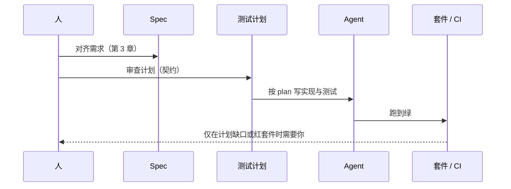

# 第 4 章：钥匙 #2 — 把正确性当契约，而不是审查

> **论点**：别再逐行审代码。在编码**之前**写好一份测试计划，把它当作验收契约，让 Agent 自己闭合正确性循环——并按照改动的复杂度决定你审多深。

---

## 为什么逐行审查在规模上失灵了

单 Agent 工作流里，读 diff 还行。Agent 生成五十行，你读五十行，你批准。就算这里也很慢，但能做。

三 Agent 工作流里，一天的产出大概是两三千行，散落在不同 PR、不同分支、代码库的不同地方。如果你试图用同样的注意力读完所有，会发生两件事：

1. 你又成了瓶颈。执行上的并行收益在审查上全丢回去。
2. 你的注意力会退化。大概到当天的第八个 PR，你开始扫读。你会批一条本不该批的东西。三 Agent 规模上的扫读审查比单 Agent 规模上的细读审查更糟。

出路不是"审得更用力"。出路是**别再审实现，改成审契约**。

## "正确性当契约"是什么意思

一段代码的正确性在操作层面上就是它必须展现的行为集合。测试编码行为。一套覆盖充分的测试，全绿，就是正确性的证据。

> **如果你在编码之前写下的测试完整表达了正确性契约，而测试全过，实现就按构造是正确的。**

这一句就是全部框架。Agent 写代码。Agent 跑测试。测试过了，你不用读 diff。测试没过，Agent 自己调试重跑直到过。你被移出了正确性验证的内循环。

人的角色挪了位置：从**审实现**（因为你得审，Agent 的产出可能是错的）挪到**审测试计划**（因为 Agent 本来就写不出这份计划，没有你的品味和领域理解）。

## TPD vs TDD

测试驱动开发（TDD）的经典形式——红、绿、重构——是一种**人**的纪律：一次一个测试、一个小的行为增量、短反馈循环、测试存在是为了指导写代码。

测试计划驱动开发（Test-Plan-Driven Development，TPD）不一样。你一次性产出**覆盖整个功能的完整测试计划**，然后把整件事交给 Agent，它把实现和测试一起写出来，对着这份计划闭合循环。

| | TDD（人） | TPD（Agent 辅助） |
|---|---|---|
| 粒度 | 一次一个测试 | 整个功能的测试计划 |
| 目的 | 渐进引导**写代码** | 为自主执行划一条*正确性边界* |
| 反馈节奏 | 每条测试红绿 | 每跑一次全套红绿 |
| 主要受益者 | 人类开发者 | 自己闭合循环的 Agent |

TPD 不是在"智识实践"意义上替代 TDD。它是针对"实现会被某种东西一口气写完、而那种东西能每 30 秒跑一次全套测试"这个情境打造的另一种形状。

> **TDD 是人的编程纪律。TPD 是人给 Agent 的验收契约。**

（TPD 这个名字是为了和 TDD 对照起的一个方便叫法。业界不是标准术语。别为它吵架。）

## 2026 年正确性共识：Adversarial Agent Pattern

"把正确性当契约"的当前最干净实践是 **Adversarial Agent Pattern**（对抗式 Agent 模式），在 [Augment Code Spec-Driven Development 指南（2026 年 4 月）](https://www.augmentcode.com/guides/what-is-spec-driven-development) 里有最清楚的定义。它把一些 2025 年实践者临场在做的事固化下来，并且——因为它把**验证**角色交给一个上下文不同、通常模型也不同的**独立** Agent——直接处理了本章稍后会讲到的盲点问题。

这个模式有三个角色：

- **Coordinator（协调者）。** 读 spec（第 3 章），把它拆成子任务、分配下去。
- **Implementor（实现者，一个或多个）。** 每个 Agent 在自己的 git worktree 里独立做一个子任务。它们看不到彼此的上下文——只能看 spec 里的接口契约。
- **Verifier（验证者）。** 一个**独立的** Agent，它的唯一工作是把每个 Implementor 的产出对着 spec 的验收标准做检查。它没有看过实现过程——只看 spec 和最终 diff。

模型分层已成当前约定：最强模型写 spec，中档模型实现，快而便宜的模型验证。成本上，这比让顶级模型全流程做事便宜。正确性上，它远**强**于"一个 Agent 一边写代码一边写测试一边给自己打分"——因为 Verifier 从未和 Implementor 共享过理解，它只能对着 spec 看现实跑出来什么样。

这直接回应了你会在下面看到的"测试和代码共享盲点"问题。当 Verifier 独立，Implementor 实现里的一个误解即便被它自己的测试一起锁进去了，也会被捕捉到——因为 Verifier 是新鲜地读 spec、检查现实的。

> **对任何不 trivial 的正确性面，明确采用 Adversarial Agent Pattern。** 把它建模成三个角色、三个独立上下文。让一个 Agent 写代码**又**写测试**又**给自己打分，是一次退步，不是一套工作流。

### 把 spec 转成测试计划的 prompt

如果你的工具没内建 Verifier 角色，你可以手动搭一个——开一个新 session，只加载 spec（不带实现上下文），然后这样问：

> 你是 Verifier。你会收到一份 spec 和一份 diff。你的工作：对 spec 里的每一条验收标准，给出 YES / NO / PARTIAL 的结论；对每一个 NO 或 PARTIAL，指出具体的文件和行为。你**没有**Implementor 的推理过程——只有 spec、diff 和交付后的代码库。优先怀疑，不是同意。

这条 prompt，配上第 3 章的六元素 spec，就是最小可用 Verifier。搭起来一小时的活，能捕捉相当比例的"实现偏离了 spec，但 Implementor 自己的测试过了"这类失败。

## 一份好测试计划覆盖什么

测试计划是交付物。它应该覆盖三层：

1. **单元测试。** 单个函数和模块的行为。"给这个输入，这个函数返回这个输出。" Agent 写这些针对纯逻辑。
2. **集成测试。** 模块之间的交互。"job scheduler 调 retry handler 时，重试会按预期的 backoff 排好。" Agent 写这些针对架构步定义的模块边界。
3. **端到端 / 功能测试。** 用户路径。"用户能上传文件、等待处理、下载结果，下载的文件在预期变换后和上传的一致。"

每一层的敏感度不同。单元抓逻辑错误，集成抓接线错误，E2E 抓真实组合错误。少任何一层，都会漏一类。

好的测试计划也会**命名未覆盖**的东西——你显式不测的行为（性能、罕见并发路径、视觉回归）。命名未覆盖，防止"假装完整"的错觉。

## Agent 能操作的环境——对 TPD 不是可选项

TPD 的前提是：Agent 能**观察到**测试计划所断言的那层现实，并在失败时**自行行动**而不把你拉回内循环。可复现的 **Docker**（或同类容器）通常是起点——依赖钉死、种子数据、一条命令起全栈。把这份镜像当作契约的一部分，和代码一样检入、版本化。

**光有镜像不够。** 环境还必须暴露验收标准真正需要的**能力形态**。缺了这一层，就会出现 CI 全绿、但 spec 关心的产品路径根本没被测到的情况。

- **浏览器型产品。** 用户通过 Web UI 交互，则 Agent（以及 E2E 工具链）在环境里必须有**可用的浏览器自动化**：工具能驱动的 headless/headed 浏览器、稳定的 base URL、按文档准备的 cookie/会话夹具。"容器里只跑 `npm test`，却没人能打开 `https://localhost:3000`" 属于断裂的 TPD 面——Agent 无法对你计划里写的布局、流程、前端回归自行闭合循环。
- **GUI / 原生 / 桌面应用。** 若正确性包含窗口、菜单、原生控件，环境必须暴露 **GUI 使用能力**——例如带文档的虚拟显示与远程会话、或 Agent 可登录的桌面会话——不能只有 CLI 和单元测试。否则测试计划会在唯一出 bug 的渠道上悄悄留空。
- **复杂或并发系统。** 当失败依赖时序、跨进程状态，或需要对着运行中的代码单步排查时，**调试器**（挂到正确进程、断点、看变量、抓栈）必须在 Agent 可用、且与资深工程师同等约束下可用。只靠 `println` 排查，套件一红就把你重新变成瓶颈。

**Verifier 同一套标准。** 独立的 Verifier 若不能起栈、不能驱动浏览器、不能挂调试器，它多半是在做「文本对文本」核对——有用，但替代不了 spec 所承诺的那些行为形态下的核验。

把这些能力写进仓库（`compose.yaml`、`AGENTS.md` 或简短的 `docs/agent-environment.md`）：如何启动环境、哪些端口暴露 HTTP、如何连上浏览器驱动、如何开 GUI 会话、如何挂调试器。**若未写清楚且 Agent 够不到，它就不在你的正确性契约里——只是愿望。**

## 藏起来的风险：测试和代码共享盲点

这一节是几乎没人写过的。如果 Agent*同时*写实现*和*测试，用的是对需求的同一份理解，而那份理解错了，**测试会过，代码还是错的**。测试验证的是代码做了什么，不是它该做什么。它们把误解一起锁住。

缓解是结构性的：

1. **测试计划在实现开始前由人审查。** 不是测试体——而是**测试计划**。计划描述"应该是什么"，测试体描述"怎么验证"。审计划就是审意图。
2. **测试计划从需求 spec 写，不从提议实现写。** 如果让 Agent 在写完代码后（甚至同时）写计划，这个性质就丢了。步骤顺序很重要。
3. **人按复杂度分层审高风险行为的覆盖度。** 复杂度启发式在这里又被用到了。

## 按复杂度分层的审查深度

作者自己的实践：**复杂度越高，审得越深。复杂度低，放手。**

应用到测试计划：

**深审**：

- 不可逆动作（支付、删除、数据迁移）
- 跨模块改动
- 安全和鉴权路径
- 任何难以回滚的失败模式
- Agent 先验已知偏弱的领域

**放手**：

- CRUD
- 内部工具和一次性脚本
- 低风险、模式成熟的场景
- 容易回滚的改动

"放手"不等于"没测试计划"。意思是：扫一眼计划、确认形状对、相信 Agent 填细节、不花注意力逐条审。测试还是要有；你只是不花审支付流一样的注意力深度去审。

这条是我最想让一个第二阶段读者内化的实用原则。第一阶段的天真失败是什么都以同样强度去审；第四阶段的天真失败是什么都不审。按复杂度分层是能 scale 的中间路线。

## Agent 当用户测 UI 工作

自动化的单元、集成、E2E 测试抓不到 UI 层的抱怨：蹩脚文案、凌乱布局、技术正确但用户看不懂的错误提示、能跑但要点太多次的流。对这些，Agent 可以扮演用户——驱动浏览器、填表单、报告体验。唯一值得记的诀窍：**让 Agent 扮演一个具体命名的用户角色**（新手 / 熟手 / 对抗），并且把它约束在*只拥有那个角色拥有的感官*里。新手角色的 Agent 只能报"我点了保存，页面空白了 5 秒"——不能报"init 失败 500"，因为它看不见控制台。这个约束是让报告呈现真实用户形状而不是工程师形状的关键。具体实现细节在 [`zero-review/auto-test`](https://github.com/A7um/zero-review/tree/main/skills/auto-test)。

## 你不再做什么

具体化一下，第三阶段及以后你*退出*的审查实践：

- 逐行读 diff。没有了。
- 靠读代码抓 bug。没有了。测试应该抓 bug；如果抓不到，计划不全，修**那里**。
- PR 评论里挑风格。由 skill 强制的约定替代（第 5 章）。
- 检查代码能跑。由 CI + Agent 跑套件替代。

剩下的：

- 审测试计划的覆盖是否充分。
- 只对高风险改动点抽查实现。
- 读 Agent 当用户报告。
- 最终放行批准。

## 最近六个月先驱在做什么

当前实践——严格限定 2025 年 11 月到 2026 年 4 月窗口：

- **Mitchell Hashimoto 在 [*My AI Adoption Journey*（2026 年 2 月）](https://mitchellh.com/writing/my-ai-adoption-journey)** 里，把失败当作加确定性钩子和测试、阻止这类失败再发生的时机。测试不是开发副产物——它们是永久的 harness。
- **Opus 4.5 的 "No Restart" 工作流**，[*Claude Opus 4.5 Unlocks the "No Restart" Workflow*（2025 年 12 月）](https://bytesizedbrainwaves.substack.com/p/claude-opus-45-unlocks-the-no-restart) 有记录，第一次让长时间无人看守的"测-修-测-修"循环切实可行。含义直接：如果 Agent 能跑套件、调失败、继续跑而不丢上下文几小时，你就真的可以不再读 diff。
- **Geoffrey Huntley 的 Ralph 循环** 把测试（和构建、lint）显式当作**反向压力**：循环在结构上没法越过失败的套件往前走。文档到[2025 年底](https://ghuntley.com/ralph/)仍然有效。
- **Claude Code 的 Plan Mode**，2025 年底到 2026 年初固化（[2026 完整指南](https://codewithmukesh.com/blog/plan-mode-claude-code/)）把"先规划再编码，对着规划验收"的循环烤进工具里。你不再是在一个通用聊天机器人上叠 TPD；工具本身强制它了。
- **Adversarial Agent Pattern**（上文已讲）是共识的形式化表达。把 Implementor 和 Verifier 分开，按角色分层模型，永远不让一个 Agent 给自己打分。

这种收敛值得注意，因为这些实践者并非互相抄。每个人都独立地走到"测试先于代码、验证由写代码角色之外的角色来做"这个结论，作为同一底层问题的显然解：逐行审查是第一个停止 scale 的东西。

## zero-review 参考

`zero-review/auto-dev` skill 把 TPD 循环端到端编码，包括下一章描述的架构步。它和 `auto-req`（第 3 章）、`auto-test` 一起构成作者单 Agent 执行的工作 skill 栈。并行调度（第 7 章）就是把这些 skill 跑在多个 Agent 上。

*参考*：[`zero-review/auto-dev`](https://github.com/A7um/zero-review/tree/main/skills/auto-dev)

---

## 外部声音

- **支持 — Adversarial Agent Pattern**：[Augment Code SDD 实践者指南（2026 年 4 月）](https://www.augmentcode.com/guides/what-is-spec-driven-development) 是当前 Coordinator / Implementors / Verifier 分层加模型分层的权威参考。2026 年 1 月 [*Spec-Driven Development* 论文](https://arxiv.org/abs/2602.00180) 是学术版。
- **支持 — 扩展的自主循环**：Opus 4.5 的 [No Restart 工作流](https://bytesizedbrainwaves.substack.com/p/claude-opus-45-unlocks-the-no-restart)（2025 年 12 月）是让 TPD 风格的无人值守"测-修-测-修"循环在规模上真正可行的能力。
- **支持 — 别审查，做工程**：Geoffrey Huntley 的 [Ralph 循环](https://ghuntley.com/ralph/) 主张一旦 Agent 能对着反向压力自我验证，逐行审查就结构性地过时了；工程师的工作是设计护栏——pre-commit 钩子、property-based 测试、快照测试——不是读 diff。
- **反驳 — 测试证明不了正确性**：Hillel Wayne 的 [*Why Don't People Use Formal Methods?*](https://www.hillelwayne.com/post/why-dont-people-use-formal-methods/) 仍然是对 TPD 所继承那条局限最锋利的表达。Adversarial Agent Pattern 显著收窄了这道缝（独立 Verifier、spec 作为契约），但没关上它。对真正高风险的正确性面，测试仍然是*正确性工具箱*里的一项，不是证明。
- **反驳 — "你不知道自己是不是拿到了对的 spec"**：Wayne 指出的根本验证问题——任何测试套件只跟它所编码的需求一样好——是为什么 2026 共识的 spec 必须有六元素（第 3 章），而不是三。没有显式的结果和约束，只有验收标准，依然会把误解锁死。

## 下一章

第 5 章讲钥匙 #3：如何把工程纪律——命名、分层、模块设计、提交规范——编码成 Agent 自己执行的 skill，以及 skill 注入到哪里仍然不够。
