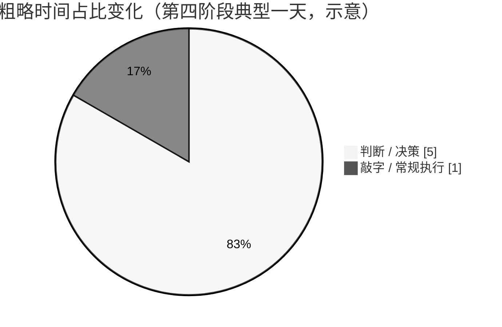

# 第 9 章：这不会让你更轻松

> **论点**：你用肌肉记忆换来了持续的判断力。产出在翻倍，认知负担持平甚至上升。如果你不主动给自己留缝，你会在比以前更高的产出水平上被烧穿。

---

## 不舒服的招供

到这里每一章都在讲怎么做更多事。这一章是唯一一章讲那代价是什么。

并行 AI 开发是一个加杠杆的位置。杠杆放大回报，也放大需求。美元生产力上升；生命小时生产力不上升。你会交付更多，而一天结束时你会比自己写代码那种日子更累——经常*更*累，因为工作的组合变了。

没有人卖 AI 生产力的时候愿意说这件事。但如果这本书不说，它就不是一本诚实的书。

Mitchell Hashimoto 的 [*My AI Adoption Journey*（2026 年 2 月）](https://mitchellh.com/writing/my-ai-adoption-journey) 对这笔交易的这一面说得异常清楚。他把它描述为三阶段弧线：*效率低下*（痛苦的磨合期）、*够用*（Agent 能干了但你累）、*终于工作流浮现*——杠杆开始感觉自然的那一阶段。他在第三阶段明确的持续纪律：深度工作时关通知、批量读报告、你离开键盘时也让背景 Agent 在跑，这样"我不能工作时也会有正向进展"——都是专门用来让判断力储备消耗不要超过补充速度的设计。

Armin Ronacher 的 [*A Language For Agents*（2026 年 2 月）](https://lucumr.pocoo.org/2026/2/9/a-language-for-agents/) 提出配套担忧：*理解力债务*。当生成看起来合理的代码变得 trivial，你积累起来的是能跑但你无法解释其逻辑的代码。第四阶段的吞吐下，这笔债长得快。Ronacher 的指导不打折扣：**如果你没法解释代码，它就还没准备好发布。** 单这条规则就把 Agent 本该移除的一部分认知负担又装回来了——从某种意义上说，这就是本章的全部要点。

Simon Willison [blogmarks](https://simonwillison.net/dashboard/blogmarks-that-use-markdown/) 里引用的研究（Ranganathan & Ye）发现 AI 并不减少知识工作，而是*强化*它：开发者 juggle 更多活跃线程，不更少。三位先驱都在第四阶段成功工作。没有一个把体验描述为放松。

## 你一天到底变了什么

想一个传统工程师一天的感觉。你坐下来，接任务。想一会儿、写点代码、跑起来、再想、调整。认知曲线是**混合**的：一些分钟密集（调一个难 bug、把抽象做对），更多分钟半自动（打你打过一万遍的样板代码、接表单、写直白循环）。你的手和脑交替用。卡住时有一个半自动动作——"先试显然的那个"——后台认知可以带着它跑，前台注意力恢复。

现在比较第四阶段并行一天。半自动工作你花的时间几乎没有——Agent 做了。留给你的是**判断工作，持续**：

- 这个需求真的清了吗？（第 3 章）
- 这份测试计划覆盖了要紧的东西吗，以匹配复杂度的深度？（第 4 章）
- 我该批这个架构还是推回去？（第 5 章）
- 这三次尝试里有一次够好能发吗，还是我想要第四次？（第 6 章）
- 哪个 Agent 在跑哪个模式，我轮转得对吗？（第 7 章）
- 分诊层这周漏了什么？（第 8 章）

**每一条都是决策。** 决策在认知上贵得和敲键盘不是一个量级。敲样板代码对前额叶是休息。一天什么都不做只做决策的，不是。

> **你从"一点体力 + 一点脑力"变成了纯脑力。吞吐更高。疲倦也更高。**

## 为什么吞吐上而"放松感"不上

粗略算一算典型一天的变化：

- **敲字小时**：6 → 1。大赢。
- **思考小时**：2 → 5。大亏。
- **总小时**：8 → 6。小赢。
- **交付件数**：1 个功能 → 3 个功能。大赢。

标题是真的：更多交付、更少小时。但那些小时的分布惨烈。五小时持续决策、几乎没有减压窗口，比八小时混合工作更耗尽。你的*生产力*上升。你的*储备*下降。

这不是纪律不够的副产物。它是结构的。三把钥匙专门把机械工作从你的天里移出去。剩下的就是机械工作原本在遮盖的东西——事实是，你现在做的这种级别的软件工程就是持续判断。

## 主动护住缝隙

能在这个角色上跑长远的工程师，不是"工作更用力"的那个。是**刻意保护休息窗口并把它当作基础设施**的那个。

一些有用的实践：

- **批量读 Agent 产出。** 别当聊天消息对待。一天两三个专门读窗口，其它时间关通知，给你上下文切换预算花在对齐而不是反应上。
- **早上做对齐，下午做审查。** 对齐要深度注意力；审查要的少。把认知状态匹配到任务是实打实的百分点。
- **在决策预算处硬停。** 一天做了 15 个实质决策后，你下一个决策明显比第 5 个差。停。剩下的活留到明天。
- **别把"放手"和"自由"搞混。** Agent 在跑；你*可以*再开三个。单 Agent 的边际成本对你来说小——但非零。加 Agent 填本该休息的时间，是这种工作流通往燃尽最快的路。
- **保护无结构思考时间。** 你仍然需要时间想项目的形状、而不是当前任务的形状。那时间不会自然出现；你必须安排。
- **刻意定期跳出循环。** 每周一天不碰 Agent。这样做之后，你*工作*那些天的杠杆回报会上升，不会下降。

## 一个有用的重构

我找到最有用的重构：**你不再是软件工程师。你是一个软件工程系统的操作员。**

手工写代码的独立开发者像铁匠：上手、一次造一件、疲劳由工作的物理节奏定速。第四阶段跑并行 Agent 的工程师像工厂主管：设计产线、设定质量线、走地板、在有问题时介入、让几个工位协调。

工厂出更多。主管也在一天结束时更累，以不同方式累——没烫手的疤，但判断储备被抽干。他没法在一天结束时"再多工作一小时"；判断不像打字那样线性按时间 scale。

这不是坏交易。做了切换的人大多不会回去。但它**是**一笔交易，不是每个轴上都赢。

## 什么时候慢下来

过度扩张、该收回来的信号：

- 你不再真读测试计划就批。
- 分诊 Agent 在升级东西，你该再升的没升。
- 你逮住自己在直接写代码而不是走管道——不是因为更快，而是因为想管道感觉像费劲。
- 你对 Agent 发脾气，而那些事其实是你的责任（对齐模糊、测试计划不清）。
- 到周末你讲不清哪个项目在好状态。

任一条都是把并发降几天、恢复储备、在更低水平重启的信号。杠杆会在你回来时还在。

## 诚实底线

并行 AI 开发，在本书作者的经验里，是一个软件工程师工作生涯里自源代码管理引入以来最大的生产力变化。它确实是工作日上你能交付的 3–5 倍乘数。它也是一种日均总认知负担更高（而非更低）的工作流。

这两条都是真的。只告诉你第一条而不提第二条的人在推销。只告诉你第二条的人一般从未走出第一阶段。

这本书的目标，是把这笔交易说清楚到你能带着知情去选——然后，选了以后，给你一个合理的机会达到它真正回本的状态。

> **你在用肌肉记忆换持续判断力。那笔交易交付更多工作。它不交付更少**你的**工作。**

---

## 外部声音

- **支持**：知识工作燃尽研究一致发现——纯决策的认知曲线（相对于混合认知加自动工作）是疲惫的强预测因子。工程管理文献（Will Larson 的帖尤其）捕捉了从"做"到"决定"的转变，这在本章描述的切换里映射得很近。
- **反驳**：一些从业者报告 AI 并行让他们*更*放松，不更累，因为重复劳动没了。对某些人这是真的——尤其是那些本来日子主要是样板、现在有了更多创造时间的人。性格重要。本章的警告最适用于那些本来就跑得热的工程师。

## 下一章

第 10 章收尾：这九章里的一切都推广到代码之外。任何能拆成独立子任务的东西都遵循同样的规则。代码只是第一个把回路关上的领域。
